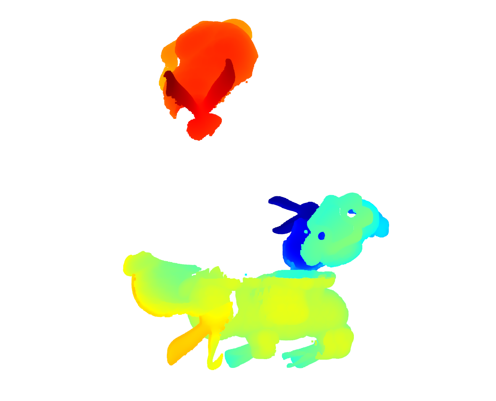
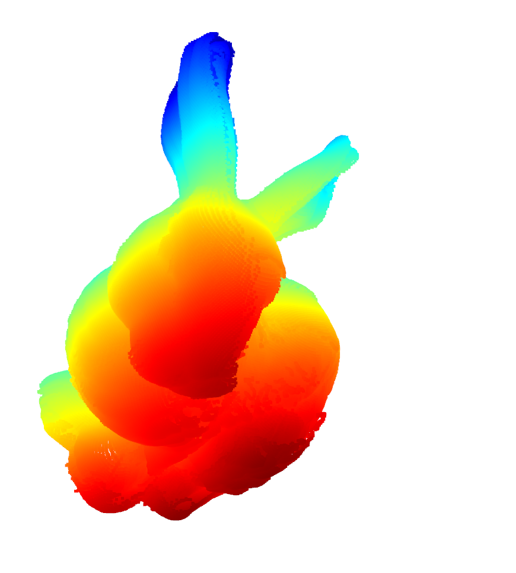
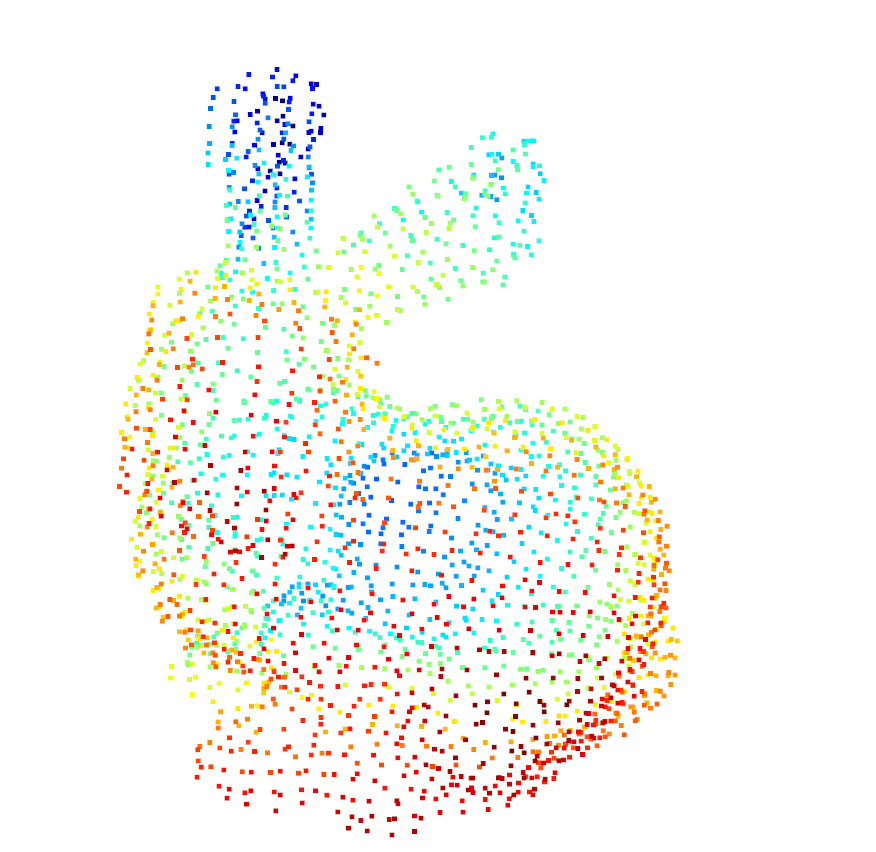

# 3D-Point-Cloud-Registration
This repository contains implementations and examples of various algorithms for 3D point cloud registration. Point cloud registration is a crucial technique in computer vision and 3D computing, aiming to align point cloud data from different sources into a common coordinate system. 
## Included Algorithms

- Iterative Closest Point (ICP)
- Generalized-ICP (G-ICP)
- Colored ICP (C-ICP)
- Coherent Point Drift (CPD)
- Feature-based registration methods
- Deep learning-based registration approaches

## Applications

- **3D Reconstruction**: Integrate point clouds from multiple viewpoints into a complete 3D model.
- **Robotics Navigation**: Assist robots in localization and mapping (SLAM) in unknown environments.
- **Medical Imaging**: Register CT, MRI, and other medical scans for better diagnosis and monitoring.
- **Geospatial Analysis**: Create accurate terrain models and monitor environmental changes.

## Dataset

- The Stanford 3D Scanning Repository http://graphics.stanford.edu/data/3Dscanrep/

## Result

Figure1: before_registration 

Figure2: after_registration 

Figure3: after_down_sample 

